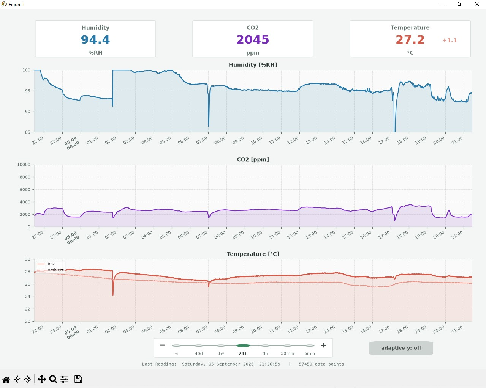

# fastnchip-sensors

Messsystem fuer eine Klimakammer auf dem Arduino Portenta Machine Control:

- SCD41 fuer CO2 und relative Feuchte
- PT100 Kanal 1 fuer die Innentemperatur
- PT100 Kanal 0 fuer die Aussentemperatur
- lokale Webseite und QSPI-Rueckpuffer
- Python-Logger mit SQLite, CSV-Export, Viewer und Backup

## Installation

1. `include/wifi-credentials.example.h` nach
   `../wifi-credentials.h` kopieren und dort `WIFI_SSID` und
   `WIFI_PASSWORD` eintragen. Die echte Datei liegt damit ausserhalb des
   Repositorys.
2. Sensorparameter und Kanalbelegung in include/config.h kontrollieren.
3. Firmware bauen: pio run
4. Erstinstallation per USB/DFU: pio run -t upload
5. Python-Pakete: python -m pip install -r logger/requirements.txt

## Betrieb

Logger: python logger/logger.py

Andere IP: python logger/logger.py --url http://192.168.31.168

Eine vorhandene measurements.csv wird einmalig nach measurements.db importiert.
Danach wird der QSPI-Puffer nachgeholt und anhand von boot_id plus sequence
duplikatfrei gespeichert.
Die Firmware erzeugt pro Start eine Hardware-Zufallskennung, damit ein
zurueckgesetzter Flash-Zaehler keine alten Messschluessel wiederverwendet.
Falls die Zufallsquelle ausfaellt, dient die gespeicherte Kennung als Fallback.

SCD41 koennen einzeln am selben Anschluss ausgetauscht werden (feste Adresse
0x62). Nach 15 Sekunden ohne gueltige Messung initialisiert die Firmware erneut
und durchsucht Wire sowie Wire1. Ohne Sensor wird alle 5 Sekunden gesucht.
Die Seriennummer steht als scd_serial in API und SQLite zur Zuordnung der
Messwerte zum jeweiligen Exemplar. Beide erhalten denselben festen Offset
aus config.h; eine automatische Temperaturanpassung findet nicht statt.
Zwei SCD41 duerfen nicht gleichzeitig am selben I2C-Bus angeschlossen werden.

## Firmware-Struktur

Die Firmware ist entlang ihrer Verantwortlichkeiten unterteilt:

- `SensorManager`: SCD41- und RTD-Hardwarezugriff
- `MeasurementController`: Messtakt, Verlauf und Datenfluss
- `QspiStorage`: persistenter Messpuffer und Partitionen
- `FirmwareUpdater`: OTA-Datei, Pruefung und Aktivierung
- `WebServer`: WLAN, HTTP-API und UI-Auslieferung
- `Application`: explizite Verdrahtung und Ablaufsteuerung

Sensorinitialisierung, HTTP-Empfang, OTA-Upload und Backlog-Auslieferung werden
schrittweise im Hauptloop verarbeitet. Nur notwendige Start-/Reset-Wartezeiten
sind blockierend.

Viewer: python logger/viewer.py

CSV fuer Excel: python logger/logger.py --export-csv

## Datenqualitaet

Sensorfehler werden als SQL NULL plus Validitaetsflag und RTD-Fehlercode
gespeichert. Geraete-Uptime und Sequenznummer machen Neustarts und Luecken sichtbar.

Der SCD41-ASC ist standardmaessig deaktiviert, da eine geschlossene Kammer nicht
regelmaessig 400-ppm-Frischluft sieht. Der SCD41-Temperaturoffset wird bei jeder
Initialisierung aus config.h gesetzt und vom Sensor zur Kontrolle zurueckgelesen.
Der Abgleich zum inneren PT100 verwendet: neuer Offset = bisheriger Offset
+ SCD41-Temperatur - PT100-Innentemperatur. Er setzt vergleichbare, stabile
Temperaturen an beiden Messorten voraus. Der Hoehenwert steht in config.h.
Betrieb nur ohne Kondensation.

SQLite speichert die korrigierte SCD41-Temperatur separat als temp_scd_c und den
zurueckgelesenen Offset als scd_temperature_offset_c. Alte Zeilen bleiben dort
NULL. Viewer und Webansicht verwenden weiterhin ausschliesslich die PT100-Werte.

Die PT100-Messung verwendet Dreileiterkompensation und einen 50-Hz-Netzfilter.
configure_rtd_driver.py passt beim Build den fest auf Version 1.0.5 gesetzten
Arduino-MAX31865-Treiber an: 50 Hz und 70 ms Wartezeit fuer Einzelmessungen
(laut Datenblatt bis zu 66 ms). Die heruntergeladene Bibliothek bleibt unveraendert.
Vor jeder Messung werden Dreileitermodus und Filter neu gesetzt und zurueckgelesen;
nach der Konversion wird die Konfiguration nochmals geprueft. So bleibt ein
alleiniger MAX31865-Reset nicht dauerhaft als fehlende Leitungswiderstands-
kompensation unentdeckt. Bei fehlgeschlagener Pruefung ist der Messwert ungueltig.
API, QSPI und SQLite speichern ADC-Rohwerte, die Konfiguration vor/nach der
Messung (`rtd_box_config_before/after`, `rtd_outer_config_before/after`) sowie
`rtd_config_recoveries`, den kumulativen Zaehler der Korrekturversuche seit Start.
Im Normalbetrieb ist die Konfiguration 17 (0x11: Dreileiter, 50 Hz, Bias aus).
Die Pruefung stellt feste Hardwareeinstellungen wieder her; sie kalibriert
keine Temperatur und veraendert den festen SCD41-Offset nicht.

Ein begrenzter Vergleich kann ueber RTD_DIAGNOSTIC_SAMPLES aktiviert werden
(0 = aus). RTD_DIAGNOSTIC_TWO_WIRE waehlt fehlende Dreileiterkompensation statt
60 Hz als Vergleich. Regulaere Messwerte bleiben bei Dreileiter/50 Hz;
Vergleichswerte stehen separat in API und QSPI. Absichtliche Moduswechsel
erhoehen ebenfalls den Korrekturzaehler. Im normalen Build ist der Vergleich aus.
Zum reproduzierten Temperatursprung siehe [Untersuchung vom 09.09.2026](docs/pt100-offset-2026-09-09.md).

## Persistenz und Backup

Der Portenta schreibt NDJSON auf QSPI und rotiert bei 4 MiB. SQLite ist die
fuehrende Langzeitspeicherung. backup.py sichert eine laufende Datenbank konsistent.

## OTA und Tests

pio run erzeugt firmware.ota. upload_firmware.ps1 akzeptiert kein rohes BIN.

Tests: python -m unittest discover -s test -p "test_*.py"
